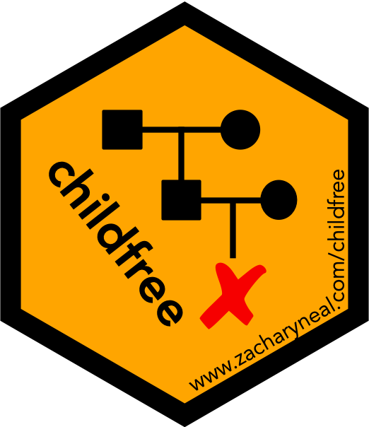

```{r, include = FALSE}
knitr::opts_chunk$set(collapse = TRUE, comment = "#>")
knitr::opts_knit$set(global.par = TRUE)
```

```{r, echo = FALSE}
set.seed(5)
oldmar <- par()$mar
par(mar = c(0, 0, 0, 0) + 0.1)
```

# Table of Contents {#toc}

[](https://www.zacharyneal.com/childfree)

1. [Introduction](#introduction)
    a. [Welcome](#welcome)
    b. [Loading the package](#loading)
    c. [Package overview](#overview)
    d. [Terminology](#terminology)
    e. [Warnings](#warnings)
2. [Datasets](#data)
    a. [Demographic and Health Surveys (DHS)](#dhs)
    b. [National Survey of Family Growth](#nsfg)
    c. [State of the State Survey](#soss)

# Introduction {#introduction}

## Welcome {#welcome}
Thank you for your interest in the childfree package! This vignette illustrates how to use this package to access and harmonize demographic data to study childfree individuals. *Childfree individuals* are people who neither have nor want children [@neal2023framework]. The fact that they do not want children makes them different from other types of non-parents including *not-yet-parents* who want children in the future, *childless* individuals who cannot have children, *undecided* people who do not know if they want children in the future.

The `childfree` package can be cited as:

**Neal, Z. P. and Neal, J. W. (2024). childfree: An R package to access and harmonize access and harmonize data on childfree individuals. *Comprehensive R Archive Network*. [https://cran.r-project.org/package=childfree](https://cran.r-project.org/package=childfree)**

For additional resources on the childfree package, please see [https://www.zacharyneal.com/childfree](https://www.zacharyneal.com/childfree).

If you have questions about the childfree package or would like a childfree package hex sticker, please contact the maintainer Zachary Neal by email ([zpneal\@msu.edu](mailto:zpneal@msu.edu)). Please report bugs in the backbone package at [https://github.com/zpneal/childfree/issues](https://github.com/zpneal/childfree/issues).

## Loading the package {#loading}
The childfree package can be loaded in the usual way:
```{r setup}
library(childfree)
```
Upon successful loading, a startup message will display that shows the version number, citation, ways to get help, and ways to contact us.

## Package overview {#overview}
The primary use of the childfree package is to obtain demographic data about childfree individuals from publicly available sources. Each section of this vignette describes the data sources that are available, which include:

* United Nations Demographic and Health Surveys (DHS)
* US CDC National Survey of Family Growth (NSFG)
* Michigan State University State of the State Survey (SOSS)

*Future releases will offer access to additional data sources, and will harmonize data extracted from different sources.*

## Terminology {#terminology}
The childfree package uses the theoretical framework and terminology defined by @neal2023framework.

**Childfree**: A person who does not have children and does not want children, regardless of whether they can have children, is called "*childfree*". In contrast, a person who does not have children but cannot have children for biological or non-biological reasons is called "*childless*".

**Family Status**: The terms "childfree" and "childless" are examples of "*family statuses*". The "*ABC*" framework described how a person's family status is defined by the intersection of:

* An **A**ttitude: Do you want (more) children?
* A **B**ehavior: Do/have you had children?
* A **C**ircumstance: Are there barriers to you having children?

A "*parent*" has had children (behavior = yes). Parents may be "*fulfilled*" if they have had exactly the number of children they want, "*unfulfilled*" if they have had fewer children than they want, "*reluctant*" if they have had more children than they want, or "*ambivalent*" if they do not know how many children they want(ed).

A non-parent had not had children (behavior = no). However, attitudes and circumstances distinguish different types of non-parents. A "*childfree*" person does not want children (attitude = no), while a "*childless*" person wants children (attitude = yes) but experienced barriers (circumstance = yes), and a "*not-yet-parent*" wants children (attitude = yes) and has not experienced barriers (circumstance = no). Non-parent family statuses are "momentary," which means they describe a person's status *at the moment*. However, a single person may transition between non-parent statuses, or from a non-parent status to a parent status, over time.

**Questions**: The childfree package is primarily focused on data concerning childfree individuals. Childfree individuals can be identified in survey data using a "*WIDE*" range of questions:

* **W**ant: Do you *want* children?
* **I**deal: What is your *ideal* number of children?
* **E**xpect: Do you *expect* to have children?
* **D**irect: Are you childfree?

Each type of question has advantages and disadvantages, and can yield different results when determining which survey respondents are childfree. The dataframes generated by the childfree package contain one binary variable for each of the "WIDE" questions available in a given dataset (e.g., `cf_want`, `cf_ideal`), plus one categorical variable (i.e., `famstat`) that classifies all respondents into family statuses using all available variables.

## Warnings {#warnings}
The childfree package provides access to data about childfree individuals, and aims to facilitate research on this population. However, care should be taken when analyzing data obtained using the package's functions:

**Operationalization**: Although the functions in the childfree package aim to recode each dataset's variables in a consistent and comparable way, there are subtle differences in how variables were originally operationalized that makes perfect harmonization and comparability impossible. Exercise caution comparing the same recoded variable across datasets.

**Universes**: Each dataset accessible through the childfree package was collected from a population-representative sample. However, there is variation in the universes from which these samples were drawn, and therefore variation in the populations of which they are representative. For example, while respondents for the SOSS were sampled from all adults in Michigan, the respondents for the NSFG were sampled from US women ages 15-44.

**Weights**: Generating population estimates from these data generally requires the use of sampling weights, which are included in the dataframes generated by the childfree package. However, use of sampling weights can be complex, particularly when combining samples from multiple waves, locations, or surveys. Exercise caution using the included sampling weights.

[back to Table of Contents](#toc)

# Datasets {#data}

## Demographic and Health Surveys (DHS) {#dhs}
The United Nations [**Demographic and Health Surveys (DHS)**](https://dhsprogram.com/) program regularly collects health data from population-representative samples in many countries using standardized surveys since 1984. The "individual recode" data files contain women's responses, and are available in SPSS, SAS, and Stata formats, but downloading these files requires a [free application](https://dhsprogram.com/data/Access-Instructions.cfm). Once one or more of these files has been downloaded, the `dhs()` function imports the data, extracts and recoded selected variables, and returns a ready-to-use dataframe.

For example, the data file "AFIR71FL.SAV" is the SPSS-format file containing data collected in Afghanistan during the Phase 7 in 2015. After downloading this file

```
> dat <- dhs(file = "AFIR71FL.SAV")
```

will import the data, extract and recode variables, and return an R dataframe called `dat`. Inspecting selected variables for the first observation in `dat`

```
> t(dat[1,3:9])
          1                     
famstat   "Parent - Unfulfilled"
sex       "Female"              
age       "22"                  
education "0"                   
partnered "Currently"           
residence "Urban"               
employed  "0"       
```

we see that it contains the record of an unemployed 22 year old Afgani woman who has no formal education, is currently partnered, and lives in an urban area. She is an "unfulfilled parent," which means that she has already had children and wants to have more children.

[back to Table of Contents](#toc)

## National Survey of Family Growth (NSFG) {#nsfg}
XX

[back to Table of Contents](#toc)

## State of the State Survey (SOSS) {#soss}
We can obtain data from the 84th SOSS wave, which was collected in April 2022 using:

```{r}
dat <- soss(waves = 84, progress = FALSE)
```

which returns the data in a dataframe called `dat`. Inspecting selected variables for the first observation in `dat`

```{r}
t(dat[1,c(2:9,12:13)])
```

we see that it contains the record of an 65 year old non-hispanic white female. She is an unemployed (retired?) high school graduate living with her partner in the suburbs, and identifies as slightly liberal, but not as religious. She is a parent-unclassified because she has had one or more children, but cannot be further classified as a specific type of parent (e.g., fulfilled, unfulfilled).

[back to Table of Contents](#toc)

```{r, echo = FALSE}
par(mar = oldmar)
```

# References
